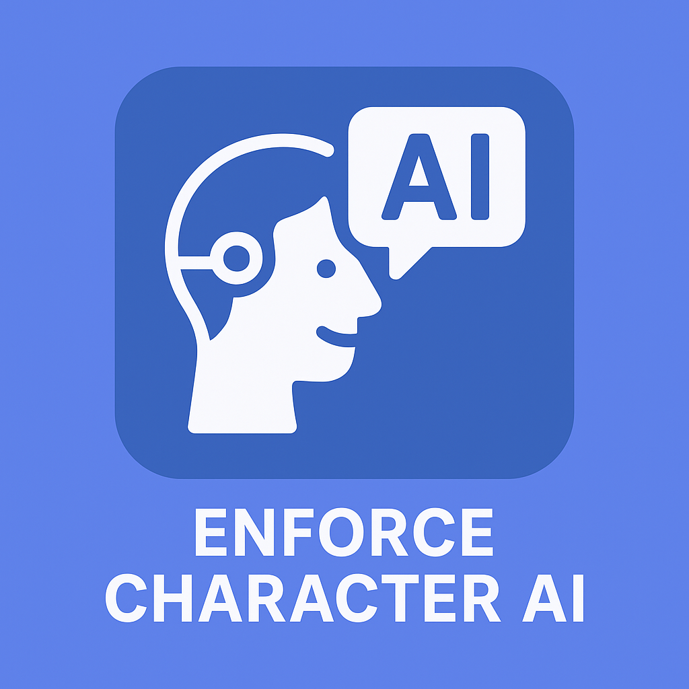

# Enforce Character AI 0.1.1



## Overview

Enforce Character AI is a comprehensive desktop application for managing, processing, and curating large-scale character image datasets, with a focus on AI/ML training workflows. It provides a user-friendly graphical interface for dataset organization, image processing, quality control, and provider management, streamlining the preparation of high-quality datasets for machine learning models.

## Features

- **Graphical User Interface (GUI):** Built with Tkinter for easy navigation and management.
- **Character Management:** Add, edit, and organize character profiles, each with associated metadata and images.
- **Image Processing Pipeline:** Modular, stage-based processing (import, deduplication, upscaling, resizing, inpainting, quality control, finalization).
- **Provider Management:** Import and track image sources/providers.
- **Progress Tracking:** Visualize processing progress for each character and stage.
- **Splash Screen & Error Handling:** Professional startup experience and robust error reporting.
- **Extensible Architecture:** Easily add new processing stages or providers.

## Changelog

### Version 0.1.1 (05.10.2025)
- Add auto installing of pytorch with CUDA support if GPU is available.
- Cropping face image now rotates the face to be straight, and crops more area to include the entire head.
- Added start.bat and start.sh which installs and launches the app.
- Improve Providers tab to support progress tracking of the import and to not freeze the app on scene detection.
- Fix YouTube provider to work.
- Make requirements.txt strict and update to latest packages.

### Version 0.1.0 (23.09.2025)
- Initial version.

## Folder Structure

```
characters/           # Character folders, each with YAML metadata and images
input/                # Raw input images from various sources
models/               # Pretrained models for processing (e.g., GFPGAN, U2Net, YOLO, StableDiffusion)
repositories/         # External or custom code repositories
src/                  # Main application source code
    config/           # Configuration files
    models/           # Data models (e.g., CharacterRepository)
    services/         # Business logic (e.g., ImageService)
    processors/       # Image processing pipeline stages
    providers/        # Provider management
    ui/               # GUI components (tabs, splash screen, etc.)
    utils/            # Utility functions
main.py               # Application entry point
requirements.txt      # Python dependencies
```

## Getting Started

### Installation (Automatic)
1. Run the provided installation script:
   - On Windows: `start.bat`
   - On Linux/MacOS: `start.sh`
   
   This will set up a virtual environment, install dependencies, download necessary models, and launch the application.


### Prerequisites (Manual Installation)
- Python 3.10+
- Required Python packages (see `requirements.txt`)

### Installation (Manual Installation)
1. Clone the repository:
   ```
   git clone https://github.com/idinkov/enforce-character-ai.git
   cd enforce-character-ai
   ```
2. Install dependencies:
   ```
   pip install -r requirements.txt
   ```
3. Place required model files in the `models/` directory:
   - `GFPGANv1.4.pth`
   - `u2net_human_seg.onnx`
   - `yolov8n-seg.pt` (automatically downloaded)
   - (Optional) StableDiffusion models

### Running the Application

```
python main.py
```

## Usage

- **Character Tab:** Manage character profiles and metadata.
- **Images Tab:** View, add, and process images for each character.
- **Processing Tab:** Run or monitor image processing stages.
- **Provider Tab:** Manage and import image providers.

Each processing stage can be run individually or as a full pipeline. Progress and logs are displayed in real time.

## Image Processing Pipeline

The application supports a modular, stage-based pipeline:

1. **Provider Import**: Import images from providers.
2. **Duplicate Filter**: Remove duplicate images.
3. **Upscale**: Enhance image resolution.
4. **Simple Resize**: Standardize image sizes.
5. **Inpainting**: Repair or fill missing image regions.
6. **Quality Control**: Filter out low-quality images.
7. **Finalization**: Prepare images for export or training.

Each stage is implemented as a processor in `src/processors/` and can be extended or customized.

## Extending the Application

- **Add New Processing Stages:** Implement a new processor in `src/processors/` and register it in the configuration.
- **Add New Providers:** Implement a new provider in `src/providers/`.
- **Customize UI:** Modify or add new tabs in `src/ui/`.

## Contributing

Contributions are welcome! Please open issues or submit pull requests for bug fixes, new features, or improvements.

## License

[MIT License](LICENSE)

## Acknowledgements

- [Tkinter](https://docs.python.org/3/library/tkinter.html) for GUI
- [GFPGAN](https://github.com/TencentARC/GFPGAN), [U2Net](https://github.com/xuebinqin/U-2-Net), [YOLO](https://github.com/ultralytics/yolov5), [Stable Diffusion](https://github.com/CompVis/stable-diffusion) for model support
- [OneTrainer](https://github.com/Nerogar/OneTrainer) for training support

---

For more details, see the `docs/` folder.
